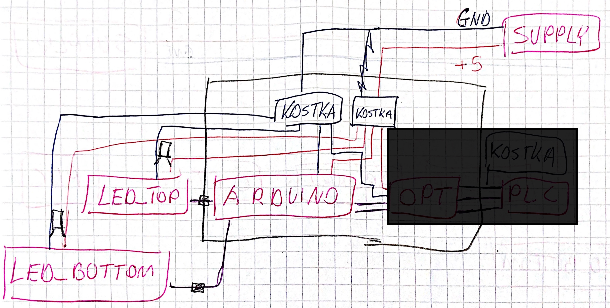
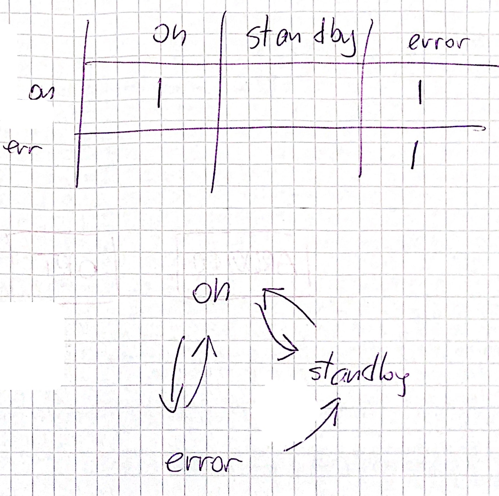

# CyberLab ReactorModel

Projekt ten jest dodatkiem do modelu reaktora z repozytorium https://github.com/wgurecky/pyReactor.

Projekt ten dodaje oświetlenie do modelu reaktora. Oświetlenie jest oparte o dwa pierścienie *NeoPixel* – jeden na górze modelu do doświetlania i drugi na dole jako promieniowanie Czerenkowa. Sterowane są one mikrokontrolerem *Adafruit Pro Trinket (16MHz)*.

Projekt składa się z następujących plików:
 - reactor_lighting.ino - program główny, w nim dzieje się cała logika
 - NeoFade.cpp - biblioteka odpowiedzialna za płynne przejścia pomiędzy dwoma kolorami
 - NeoPulse.cpp - biblioteka zajmująca się płynnym cyklicznym pulsowaniem oświetleniem
 - NeoTwinkle.cpp - generowaniem oświetlenia w stylu promieniowanie Czerenkowa

# Połączenia

Połączenie są takie jak na obrazku. Część zaciemnioną należy nie uwzględniać.

# Maszyna stanów

Projekt został oparty o maszynę stanów, gdzie:

 - standby - reaktor świeci się na zielono, stan domyślny jak i początkowy
 - on - górne oświetlenie na biało a na dole oświetlenia w stylu promieniowania Czerenkowa
 - error - czerwone pulsowanie obu pierścieni

To w jakim stanie znajduje się reaktor zależy od dwóch pinów wejściowych mikrokontrolera.

 - on - zielony kabelek
 - err - czerwony kabelek

# Dwa branche

 - master - stan jest zależny od dwóch pinów wejściowych
 - demo - modyfikacja master w której maszyna stanów zmienia swój stan on <-> err co losowy czas

# Jak uruchomić?
Należy zainstalować Arduino IDE i doinstalować wymagane sterownik do Adafruit. Czytaj nagłówek reactor_lighting.ino.

# Dodatek

Światło nie jest postrzegane przez nas liniowo a logarytmicznie. Żeby przejścia pomiędzy stanami czy miganie były płynne trzeba było to odpowiednio przeliczyć. Sposób przeliczenia wraz z krzywą znajduje się w [Excelu](logarithmic_fade.xlsx).
